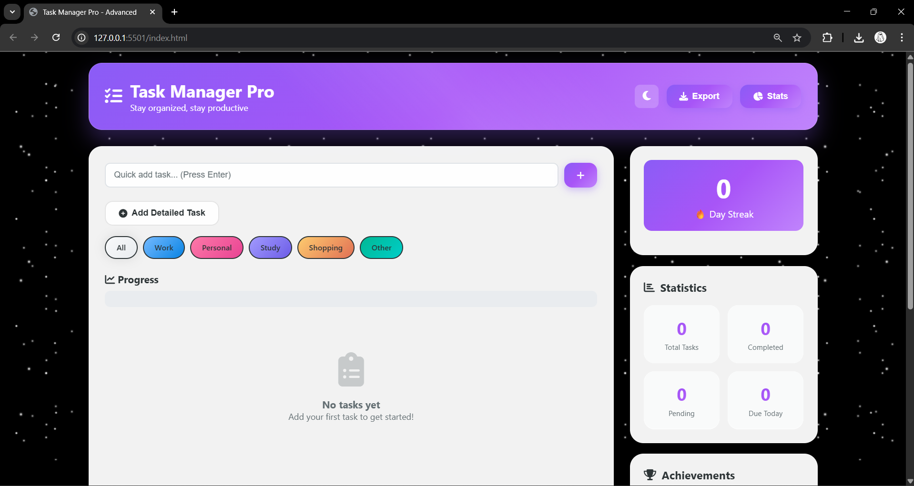
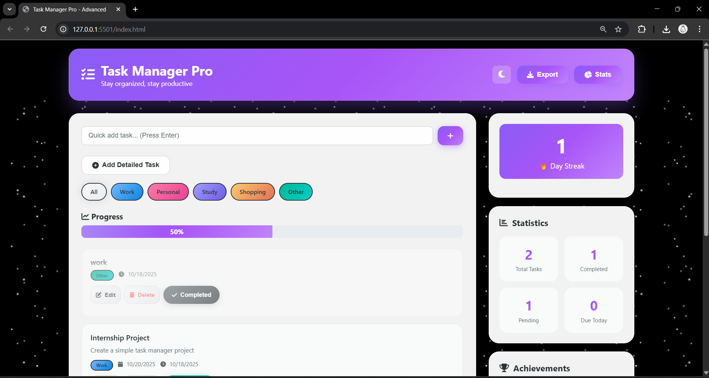

# IBM Task-Manager Project

A modern, interactive task management web app designed to help you stay organized, productive, and consistent. Task Manager Pro lets you create, categorize, and track tasks with progress visualization, daily streaks, and achievement rewards — all in a clean, responsive interface.

---

## 🚀 Overview

**Task Manager Pro** is a web-based productivity app that allows users to add, categorize, and track tasks easily. With progress visualization, daily streak tracking, achievements, and export options — this app turns task management into a fun and motivating experience!

---

## 🌟 Features

✅ **Add & Manage Tasks Easily**  
- Quick task input bar or detailed task creation option  
- Edit, delete, and mark tasks as completed  

🎨 **Smart Categorization**  
- Filter tasks by type: `Work`, `Personal`, `Study`, `Shopping`, or `Other`  
- View category-specific progress instantly  

📈 **Progress Tracking**  
- Dynamic progress bar shows your daily completion rate  
- Visual statistics for total, completed, and pending tasks  

🔥 **Day Streak Counter**  
- Keep track of your consistency and stay motivated every day  

🏆 **Achievements System**  
- Unlock milestones like:
  - 🥇 *First Step* — Complete your first task  
  - 🌟 *Getting Started* — Complete 10 tasks  
  - 🔥 *Consistency* — Maintain a 7-day streak  
  - 🏆 *Productive* — Complete 50 tasks  

💾 **Data Persistence**  
- Automatically saves your tasks (localStorage or backend-ready)

📤 **Export / Import Options**  
- Export your task data in JSON or CSV format  

🌙 **Dark / Light Mode Support**  
- Toggle between dark and light modes for better usability  

---

## 🧠 Tech Stack

| Category | Technologies |
|-----------|--------------|
| **Frontend** | HTML5, CSS3, JavaScript |
| **UI Frameworks** | Custom CSS |
| **Storage** | LocalStorage / JSON-based persistence |
| **Design Tools** | Figma (for UI prototyping) |

---

## 🖥️ Project Preview

### Dashboard (No Tasks)


### Dashboard (With Tasks)


> Add your first task to get started and unlock achievements!

---

## ⚙️ Installation & Setup

1. **Clone the Repository**
   ```bash
   git clone https://github.com/<your-username>/IBM_Task-Manager_Project.git
